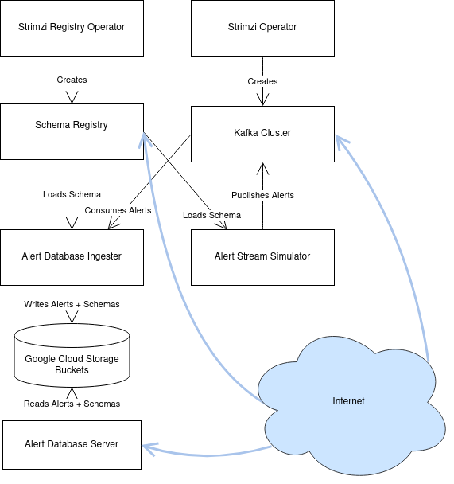

:tocdepth: 2

.. Please do not modify tocdepth; will be fixed when a new Sphinx theme is shipped.

.. sectnum::

Overview
========

Rubin's Alert Distribution System is implemented in the integration environment at the interim data facility (the "IDF").
The implementation runs on the shared Rubin Science Platform Kubernetes cluster in the IDF.

This document aims to be a point-in-time record of what exists, and to explain implementation decisions made during construction.
An overview is provided of the system's concepts and components, and then each is described in detail.

At the highest conceptual level, it is composed of an Apache Kafka :cite:`kafka` cluster, a Confluent Schema Registry :cite:`confluent-schema-registry`, software to generate simulated alerts, and an alert database implemenntation following the design laid out in DMTN-183 :cite:`DMTN-183`.

Terminology and Concepts
========================

In order to explain the components that make up the Alert Distribution System, it's helpful to first establish some basic concepts behind deployments to Kubernetes in general, and to Rubin's Science Platform Kubernetes cluster in particular.

Resources
---------

Kubernetes is built on *resources*.
These are abstract descriptions of persistent entities that should be configured and run in a particular Kubernetes cluster.
Resources are defined in YAML files which are submitted to the Kubernetes cluster.

For example, Kubernetes uses resources to define what `services <https://kubernetes.io/docs/concepts/services-networking/service/>`__ should be running, how `traffic <https://kubernetes.io/docs/concepts/services-networking/network-policies/>`__ should be routed, and how `persistent storage <https://kubernetes.io/docs/reference/kubernetes-api/config-and-storage-resources/persistent-volume-v1/>`__ should be provisioned.

Kubernetes users are able to provide custom resource types; these are used in the Alert Distribution System to describe the desired Kafka configuration.

In addition, resources are configured to reside within a particular namespace.
These namespaces act as boundaries for authorization, as well as providing naming uniqueness for resources.
Somewhat unconventionally, all of the alert stream resources are in one namespace, "``alert-stream-broker``", which is explained in :ref:`single-namespace`.

Operators
---------

Kubernetes *operators* are programs that run within the Kubernetes cluster, and take actions when resources are created, modified, or deleted.
There are many default operators, and others that are installed to the cluster explicitly.
The Alert Distribution System uses two such custom operators: Strimzi :cite:`strimzi` and Strimzi Registry Operator :cite:`strimzi-registry-operator`.

Helm Charts
-----------

Helm :cite:`helm` is a project which provides tools for templating the YAML resource definitions used in Kubernetes.
The templates are called _Charts_, and provide a flexible way to represent common or repeated configuration.

For the Rubin IDF, all charts are defined in the `lsst-sqre/charts`_ repository.

Charts are reified into infrastructure using a set of *values* which populate the templates.
For the Rubin IDF, the values to be used are defined in the `lsst-sqre/phalanx`_ repository.

These two repositories are part of the Phalanx system, described in SQR-056 :cite:`SQR-056` and at `phalanx.lsst.io <https://phalanx.lsst.io/>`__.

Argo
----

While Helm can be run as a tool on the command line, the Science Platform convention is to run it through Argo CD :cite:`argo-cd`.
Argo CD is a platform for coordinating changes to a Kubernetes cluster, and it is able to run Helm directly.
It is configured through a set of conventions in the `lsst-sqre/phalanx`_ repository.

Terraform
---------

Terraform :cite:`terraform` is a tool for provisioning infrastructure through code.
On the Rubin Science Platform, Terraform is used to provision non-Kubernetes resources, such as Google Cloud Storage buckets and account permissions for applications running inside Kubernetes to access Google Cloud Platform APIs.

Terraform source code resides in the `lsst/idf_deploy`_ repository.

Principal Components
====================

The Alert Distribution System has six principal components:

1. The **Strimzi Operator** is responsible for managing a Kafka Cluster. It configures broker nodes, topics, and Kafka user identities.
2. The **Kafka Cluster** is an instance of Apache Kafka with several broker nodes and Zookeeper metadata nodes. It holds the actual alert packet data.
3. The **Strimzi Registry Operator** is responsible for managing a Confluent Schema Registry instance, correctly connecting it to the Kafka Cluster.
4. The **Schema Registry** is an instance of the Confluent Schema Registry, along with an ingress configured to allow read-only access from the internet by anonymous users.
5. The **Alert Stream Simulator** is a subsystem which encodes a static set of alerts and publishes them to the Kafka Cluster every 37 seconds.
6. The **Alert Database** is a subsystem which archives schemas and alerts which have been published to Kafka, storing them in Google Cloud Storage buckets. It also provides HTTP-based access to this archive.

   A diagram of the principal components and their relationships.

Each of these components will now be described in more detail.

Strimzi Operator
----------------

Strimzi :cite:`strimzi` is a third-party software system for managing a Kafka cluster on Kubernetes.
It is used in the Alert Distribution System as an abstraction layer around the details of configuring Kafka on individual Kubernetes Pods and Nodes.

Strimzi works through Custom Resource Definitions, or "CRDs", which are installed once for the entire Kubernetes cluster across all namespaces.
This installation is performed automatically by Argo CD when installing the Strimzi Helm chart, as configured `in Phalanx <https://github.com/lsst-sqre/phalanx/tree/master/services/strimzi>`__ as the 'strimzi' service.

The Strimzi Operator is a long-running application on Kubernetes which does all the work of actually starting and stopping Kubernetes Pods which run Kafka.
It also sets up Kubernetes Secrets which are used for authentication to connect to the Kafka broker, and can install ingresses for providing external access to the Kafka broker.

The Alert Distribution System generally uses the default settings for the Strimzi Operator.
There are only two settings which are explicitly enabled:

.. code-block:: yaml

  watchNamespaces:
    - "alert-stream-broker"
  logLevel: "INFO"

``watchNamespaces`` is a list of Kubernetes *namespaces* to be watched for Strimzi Custom Resources by the Strimzi Operator.
In our case, this is configured to watch for any resources created in the ``alert-stream-broker`` namespace, since that namespace holds all the resources used to define the Alert Distribution System.
All resources go in one namespace; this is explained further in :ref:`single-namespace`.

``logLevel`` is set explicitly to ``INFO`` to enable logging by the Strimzi Operator itself.
Note that this configures the Operator, **not** the Kafka broker or anything else.
This can be set to ``DEBUG`` to help with debugging thorny internal issues.

Kakfa Cluster
-------------

The Kafka Cluster is at the heart of the Alert Distribution System, and is defined in terms of custom Strimzi resources.
These resources are defined with Helm templates in the `alert-stream-broker`_ chart.

The chart has the following subresources:

 1. A ``Kafka`` resource which defines the cluster's size, listeners, and core configuration, including that of the ZooKeeper nodes, in `kafka.yaml`_.
 2. A ``Certificate`` resource used to provision a TLS certificate for the Kafka cluster's external address, defined in `certs.yaml`_.
 3. A list of ``KafkaUsers`` used to create client identities that can access the Kafka Cluster, defined in `users.yaml`_ and `superusers.yaml`_.
 4. A ``VaultSecret`` used to store superuser credentials in Vault, which provides gated human access to the credential values through 1Password; see the `Phalanx Documentation on VaultSecrets <https://phalanx.lsst.io/service-guide/add-a-onepassword-secret.html>`__ for more details. This is defined in `vault_secret.yaml`_.

These will each now be explained in further detail.

``Kafka`` resource
~~~~~~~~~~~~~~~~~~

The ``Kafka`` resource is the primary configuration object of the Kafka cluster, defined in `kafka.yaml`_.
There's a lot going on in its configuration; this section attempts to explain some of the most important sections without going every line.

.. _listeners:

Listeners
*********

The ``spec.kafka.listeners`` field of the resource defines the Kafka *listeners*, which are the network addresses which it opens to receive requests; this section is essential for configuring the Kafka cluster for both internal and external access.

Kafka's listeners are complicated, and configuring them through Kubernetes is even more so.
The Strimzi blog post series on "Accessing Kafka" :cite:`accessing-kafka`  provides very useful background for understanding this section.

We use three listeners: two internal listeners with ``tls`` authentication (meaning that clients need to use mTLS authentication to connect) and one external listener.

The first internal listener, on port 9092 and named 'internal', is used by applications internal to the Alert Distribution System, such as the Alert Database and Alert Stream Simulator.

The second internal listener, on port 9093 and named 'tls', is used by the Schema Registry, since it the Strimzi Registry Operator is currently hardcoded to only use configure a Registry to connect to a listener with that name.

Because these are ``internal``-typed listeners, they are only accessible within the Kubernetes cluster, not to any users from across the internet.

The third listener is an external one, meaning that it is accessible over the internet.
It is configured to be ``loadbalancer``-typed, which tells the Strimzi Operator that we would like a `Kubernetes Service with a type of LoadBalancer`_ to be provisioned on our behalf.
This, in turn, triggers creation of a `Google Cloud Network Load Balancer`_, which has a public IP address which can be used to connect to the service.
There are two important things to note about this system.

First, it is fairly specific to Google Cloud Platform; an implementation of the Alert Distribution System on a different Kubernetes platform might require a different strategy for this external listener.

Second, it provisions an IP address automatically, without any explicit choice.
This is important because it means that we cannot automatically assign a DNS record to give a name to this external listener until the Kafka cluster has been created: we wouldn't know what IP address to have the DNS record resolve to.

This chicken-and-egg issue actually causes even more complexity, since without a valid DNS name we cannot use TLS encryption for connections to the broker, since the broker wouldn't have any hostname that it could claim.

This isn't really resolvable in a single resource creation step, but we *can* pin to a specific public IP address for the load balancer once it has already been provisioned using the ``spec.kafka.listeners.configuration.bootstrap.loadBalancerIP`` configuration field of the Strimzi ``Kafka`` resource.

The solution then is to require a multi-step process when first setting up the Kafka cluster.
First, the cluster is created without any explicit ``loadBalancerIP``.
The cluster will start with an unusable ``external`` listener, but a Google Cloud Network Load Balancer will be created.
That Load Balancer's IP address can be retrieved through the Google Cloud console, and then fed back in as the ``loadBalancerIP`` to be used by the ``Kafka`` resource, and also used to provision a DNS record for the broker's actual hostname

Then the broker can be updated, now with a valid ``external`` listener, and able to accept traffic.

Note that this needs to be done for *each broker replica*, in addition to the cluster-wide bootstrap address, since each broker needs to be separately accessible on the internet.
"Accessing Kafka" :cite:`accessing-kafka` is a useful reference to explain why this is necessary in greater detail.

An example of this pinning process can be found in Phalanx's set of values for the ``idfint`` environment of alert-stream-broker (`values-idfint.yaml`_), where the external listener's IP addresses have been pinned explicitly:

.. code-block:: yaml

    # Addresses based on the state as of 2021-12-02; these were assigned by
    # Google and now we're pinning them.
    externalListener:
      bootstrap:
        ip: 35.188.169.31
        host: alert-stream-int.lsst.cloud
      brokers:
        - ip: 35.239.64.164
          host: alert-stream-int-broker-0.lsst.cloud
        - ip: 34.122.165.155
          host: alert-stream-int-broker-1.lsst.cloud
        - ip: 35.238.120.127
          host: alert-stream-int-broker-2.lsst.cloud

Broker Configuration
********************

The Apache Kafka configuration for the broker (that is, configuration using Java properties, just as Kafka documentation suggests) is handled through the 'config' field of `kafka.yaml`:

.. code-block:: yaml

    config:
      offsets.topic.replication.factor: 3
      transaction.state.log.replication.factor: 3
      transaction.state.log.min.isr: 2
      log.message.format.version: {{ .Values.kafka.logMessageFormatVersion }}
      inter.broker.protocol.version: {{ .Values.kafka.interBrokerProtocolVersion }}
      ssl.client.auth: required
      {{- range $key, $value := .Values.kafka.config }}
      {{ $key }}: {{ $value }}
      {{- end }}

These are not particularly chosen; they are merely intended to be sensible defaults for reasonable durability.

The ``log.message.format.version`` and ``inter.broker.protocol.version`` fields deserve extra explanation, however.
These need to be explicitly set to make it possible to upgrade Kafka's version.
For more on this, see `Strimzi documentation on these fields <https://strimzi.io/docs/operators/latest/full/deploying.html#ref-kafka-versions-str>`__.

Storage
*******

The Kafka cluster's storage (that is, the backing disks used to store alert packet data) is configured directly in the ``Kafka`` resource:

.. code-block:: yaml

    storage:
      type: jbod
      volumes:
        # Note that storage is configured per replica. If there are 3 replicas,
        # and 2 volumes in this array, each replica will get 2
        # PersistentVolumeClaims for the configured size, for a total of 6
        # volumes.
      - id: 0
        type: persistent-claim
        size: {{ .Values.kafka.storage.size }}
        class: {{ .Values.kafka.storage.storageClassName }}
        deleteClaim: false

The "``jbod``" storage type requests "just a bunch of disks" - a simple storage backend.
The requests for storage are handled through Kubernetes PersistentVolumeClaims, which request persistent disks from the Kubernetes controller.

On Google Kubernetes Engine, these end up requesting persistent disks; see `the GKE documentation <https://cloud.google.com/kubernetes-engine/docs/concepts/persistent-volumes>`__ for more detail.
By requesting disks with a StorageClass of "standard", these should be general purpose SSDs.

Note that these disks can be enlarged, but never shrunk.
This is a constraint of Strimzi in order to manage Kafka disk usage safely.

Node Pool
*********

The Kafka cluster is set to run on a dedicated Kubernetes *Node Pool*, which means that it runs on single-tenant hardware dedicated just to Kafka brokers.
This is configured through pod tolerations and affinities, as is standard in Kubernetes.

Using single-tenant hardware helps ensure that community brokers will receive stable levels of network connectivity to the Kafka brokers, and also helps avoid memory pressure issues if Kubernetes' scheduler oversubscribed pods onto nodes used by Kafka.

The Kafka node pool is labeled ``kafka=ok``; this label is used for all taints, tolerations, and affinities.
This node pool is created using Terraform in the `environments/deployments/science-platform/env/integration-gke.tfvars`_ file.

The 2018 Strimzi blog post "Running Kafka on dedicated Kubernetes nodes" :cite:`strimzi-kafka-nodes` provides a good guide on how this is implemented in more detail.

.. _kafka-certificates:

TLS Certificate
~~~~~~~~~~~~~~~

The TLS certificate for the broker's external listener (see :ref:`listeners`) is configured through a ``Certificate`` custom resource.
This custom resource is used by the cert-manager :cite:`cert-manager` system which is already installed on the Kubernetes cluster.

This system works by provisioning LetsEncrypt TLS certificates automatically and storing them in TLS secrets.
The Strimzi blog post "Deploying Kafka with Let's Encrypt certificates" :cite:`kafka-letsencrypt` provides a detailed discussion of how this works, although it assumes the use of "ExternalDNS" to manage DNS records, which is different.
The Rubin Science Platform's DNS is managed manually by the SQuaRE team in Route53, so all DNS records were created manually.

The most important part of the ``Certificate`` resource is the ``dnsNames`` field which requests TLS certificates for specific hostnames.
In our Kafka installation, we need multiple such hostnames: one for each individual broker (``alert-stream-int-broker-0-int.lsst.cloud``, ``alert-stream-int-broker-1-int.lsst.cloud``, etc), and one for the cluster-wide bootstrap address (``alert-stream-int.lsst.cloud``).
As explained in :ref:`listeners`, these can only be fully configured once an IP address for an external load balancer has been provisioned, so this resource may fail when first created.

Users and Superusers
~~~~~~~~~~~~~~~~~~~~

Kafka Users are identities presented by clients and authenticated by the Kafka broker.
They have access boundaries which restrict which operations they can perform.
In the case of the Alert Distribution System, most users are limited to only working with a subset of topics.

The only exception is superusers who are granted global access to do anything.
These are administrative accounts which are only expected to be used by Rubin staff, and only in case of emergencies.

1Password, Vault, and Passwords
*******************************

User's passwords are set through the RSP-Vault 1Password vault in the LSST-IT 1Password account.
Each user gets a separate 1Password item with a name in the format "alert-stream idfint <username>", like "alert-stream idfint lasair-idint".

A username can be set in the 1Password item, but this is purely descriptive; the password is the only thing that is used.

The item uses a field named "generate_secrets_key" with a value of "alert-stream-broker <username>-password".
Through Rubin Science Platform's 1Password secret machinery, this will automatically generate a value in the ``alert-stream-broker-secrets`` Kubernetes Secret named "<username>-password" which stores the user's password; this can then be fed in to Kafka's configuration.

All most administrators really need to know, though, is:
 - Each Kafka user needs to have a separate item in the RSP-Vault 1Password vault.
 - The password stored in 1Password is authoritative.
 - Passwords can be securely distributed using 1Password's 'Private Link' feature.
 - The formatting of the 1Password item is persnickety and must be set exactly correctly.

Authentication
**************

Users authenticate using SCRAM-SHA-512 authentication, which is a username and password-based protocol.
The alert-stream-broker's `users.yaml`_ template configures each username, but lets passwords get generated separately and receives them through Kubernetes Secrets.
These passwords are then passed in to Kafka to configure the broker to expect them.

Access Restrictions
*******************

Users are granted read-only access to a configurable list of topics.
This access grants them the ability to read individual messages from the topics and to fetch descriptions of the topic configuration, but it grants them no access to publish messages or alter the topics in any way.

In addition, users are granted complete access to Kafka Consumer Groups which are prefixed with their username.
For example, the ``fink-idfint`` user may create, delete, or modify any groups named ``fink-idfint``, or ``fink-idfint-testing``, or ``fink-idfint_anythingtheylike``, but not any groups named ``antares-idfint`` or ``admin``.

The list of user identities to be created is maintained in Phalanx as a configuration value for the ``idfint`` environment in `values-idfint.yaml`_:

.. code-block:: yaml

  users:
    # A user for development purposes by the Rubin team, with access to all
    # topics in readonly mode.
    - username: "rubin-devel-idfint"
      readonlyTopics: ["*"]
      groups: ["rubin-devel-idfint"]

    # A user used by the Rubin team but with similar access to the community
    # broker users.
    - username: "rubin-communitybroker-idfint"
      readonlyTopics: ["alerts-simulated"]
      groups: ["rubin-communitybroker-idfint"]

    # The actual community broker users
    - username: "alerce-idfint"
      readonlyTopics: ["alerts-simulated"]
      groups: ["alerce-idfint"]

    - username: "ampel-idfint"
      readonlyTopics: ["alerts-simulated"]
      groups: ["ampel-idfint"]

    - username: "antares-idfint"
      readonlyTopics: ["alerts-simulated"]
      groups: ["antares-idfint"]

   # ... truncated

Explicitly listing every username like this would be clumsy for large numbers of users, but since there are a relatively small number of community brokers, this provides a simple mechanism.
Alternatives which hook into systems like LDAP are much, much more complicated to configure and might not have Strimzi support.

In the ``idfint`` environment, each user only gets access to the "alerts-simulated" topic which holds the alerts generated by the Alert Stream Simulator.

Strimzi Registry Operator
-------------------------

The Strimzi Registry Operator :cite:`strimzi-registry-operator` is a Kubernetes Operator which defines a custom resource, ``StrimziSchemaRegistry``, and which creates and manages a deployment of Confluent Schema Registry in response to instances of that resource.
The Operator is an application written and maintained by Rubin's SQuaRE team in the `lsst-sqre/strimzi-registry-operator`_ repository.

The Strimzi Registry Operator's primary value to the Alert Distribution System is that it coordinates and synchornizes credentials used to access the Strimzi-managed Kafka cluster.
The Operator is responsible for updating the deployed Schema Registry instance any time credentials are updated or changed, which can happen as a downstream consequence of changes to the Kafka cluster's configuration.

The Operator has an associated Helm chart in the `strimzi-registry-operator chart`_ directory.
This chart contains custom resource definitions, or CRDs.
These CRDs must be installed cluster-wide at a consistent version, and so the first installation of this chart through Argo is particularly important.

The Operator chart has almost no configuration.
The only options are to configure the Docker repository and tag which identifies a Docker container that runs the Strimzi Registry Operator application.
This Docker container is automatically built in the `lsst-sqre/strimzi-registry-operator`_ repository's continuous integration system and is published to the ``lsstsqre/strimzi-registry-operator`` repository on Docker Hub.

.. _strimzi-registry-operator-deployment:

Deployment
~~~~~~~~~~

The Strimzi Registry Operator deployment runs an instance of the Strimzi Registry Operator container in Kubernetes.
It configures the application through environment variables ``SSR_CLUSTER_NAME`` and ``SSR_NAMESPACE``:

.. code-block:: yaml

     containers:
        - name: operator
          image: "{{ .Values.image.repository }}:{{ .Values.image.tag }}"
          imagePullPolicy: Always
          env:
          - name: SSR_CLUSTER_NAME
            value: "{{ .Values.clusterName }}"
          - name: SSR_NAMESPACE
            value: "{{ .Values.watchNamespace }}"
          command: ["kopf"]
          args: ["run",  "--standalone",  "-m",  "strimziregistryoperator.handlers",  "--namespace",  "{{ .Values.watchNamespace }}",  "--verbose"]

These imply that the registry operator can only watch a *single* namespace and Kafka cluster at a time.
This is currently a limitation of the Strimzi Registry Operator application.
If multiple namespaces or Kafka Clusters need to be watched (perhaps because of multitenancy of the Kubernetes cluster hosting the Alert Distribution System) then multiple Strimzi Registry Operators will need to be run.

Kubernetes Permissions
~~~~~~~~~~~~~~~~~~~~~~

In order to create Schema Registry instances, the Strimzi Registry Operator needs a set of cluster-wide permissions.
These are defined in the `rbac.yaml`_ template in the Strimzi Registry Operator chart, and include the power to read and modify Secrets, Services, Deployments, and ConfigMaps.

This is a fairly broad range of capabilities, and in reality that Strimzi Registry Operator only needs those capabilities within the namespace that it is watching.
But there doesn't seem to be a simple way to limit the Operator's scope in that fashion, so it simply gets a cluster-wide scope.
Shrinking this capability set would be desirable in the future.

Schema Registry
---------------

The Schema Registry runs an instance of Confluent Schema Registry :cite:`confluent-schema-registry` which is a service that provides access to Avro schema definition documents.
These Avro schemas are used by clients consuming alert data.
The schemas provide instructions to Avro libraries on how to parse binary serialized alert data into in-memory structures, such as dictionaries in Python.

Confluent Schema Registry uses a Kafka topic as its backing data store.
The Registry itself is a lightweight HTTP API fronting this data in Kafka.

The Schema Registry is currently running at https://alert-schemas-int.lsst.cloud/.
For example, to retrieve schema ID 1, you can issue an HTTP GET to https://alert-schemas-int.lsst.cloud/schemas/ids/1.

The Schema Registry for the Alert Distribution System is implemented with a Helm chart in the charts repository, `alert-stream-schema-registry`_.
This chart defines five resources:

1. A ``StrimziSchemaRegistry`` instance which is used by the Strimzi Registry Controller, creating a Deployment of the Schema Registry, in `schema-registry-server.yaml`_.
2. A ``KafkaTopic`` used to store schema data inside the Kafka cluster, in `schema-registry-topic.yaml`_.
3. A ``KafkaUser`` identity used by the Schema Registry instance to connect to the Kafka cluster, in `schema-registry-user.yaml`_.
4. An Nginx ``Ingress`` which provides read-only access to the Schema Registry from over the public internet in `ingress.yaml`_.
5. A ``Job`` which synchronizes the latest version of the alert packet schema into the Schema Registry, in `sync-schema-job.yaml`_.

These will each be described in detail now.

StrimziSchemaRegistry instance
~~~~~~~~~~~~~~~~~~~~~~~~~~~~~~

This resource doesn't need much explanation.
It has such a small definition that it can be included here in its entirety:

.. code-block:: yaml

   apiVersion: roundtable.lsst.codes/v1beta1
   kind: StrimziSchemaRegistry
   metadata:
     name: {{ .Values.name }}
   spec:
     strimzi-version: {{ .Values.strimziAPIVersion }}
     listener: internal

Perhaps the only notable thing here is the ``listener`` field.
This must exactly match an mTLS-based listener in the associated Kafka cluster.
The "associated Kafka cluster" is the one named in the ``SSR_CLUSTER_NAME`` value in the Strimzi Registry Operator's configuration, as mentioned in :ref:`strimzi-registry-operator-deployment`.

An "mTLS-based listener" means one that uses ``tls: true`` and has an authentication ``type: tls``; see also :ref:`listeners`.

Schema Registry Topic and User
~~~~~~~~~~~~~~~~~~~~~~~~~~~~~~

The Schema Registry stores all of its underlying schema data in a Kafka topic, which is configured in `schema-registry-topic.yaml`_.
This is set to use 3 replicas for durability, but is otherwise left to almost entirely use defaults.
This topic is automatically created by the Strimzi Topic Operator.

The Schema Registry needs a Kafka User identity as well to communicate with the Kafka cluster.
This user is configured in `schema-registry-user.yaml`_, which primarily is devoted to granting the correct permissions for the user to access the Schema Registry topic.

Schema Registry Ingress
~~~~~~~~~~~~~~~~~~~~~~~

The Schema Registry needs to be internet-accessible because its schemas are used by Rubin's Community Brokers when they are processing the alert stream.
Schemas are necessary for parsing each of the alert packets in the stream, and the Schema Registry is the authoritative source for schemas.

An Ingress is a Kubernetes resource which provides this external access to an internal system.
The Rubin Science Platform uses Nginx as the Ingress implementation :cite:`nginx`.

Authorization
*************

The Schema Registry exposes an HTTP interface for access of this kind; however, it has no native support for access restrictions, so anyone who can reach it can create, modify, or even delete any schema data.
These features cannot be exposed to the general internet safely.

Therefore, the Ingress needs to *also* screen traffic to only permit read-only access.
This is accomplished through an inline Nginx "configuration snippet," which is a fragment of Nginx's own configuration language which gets injected into the Ingress's configuration.
This snippet denies all non-GET requests, and is configured through an annotation on the Ingress resource:

.. code-block:: yaml

    nginx.ingress.kubernetes.io/configuration-snippet: |
      # Forbid everything except GET since this should be a read-only ingress
      # to the schema registry.
      limit_except GET {
        deny all;
      }

Since all of the write-related APIs are behind non-GET methods, this seems to do an adequate job of protecting the Schema Registry from abuse.

TLS and Hostnames
*****************

The typical way that ingresses work is through *merging*.
In this framework, all services share a hostname, and traffic is routed based on the path in the URL of an HTTP request.

This isn't possible for the Schema Registry since it lacks a universal URL path prefix that can distinguish the requests.
We can't have the ingress rewrite requests because the Schema Registry API clients generally don't have the ability to insert a leading path component either.
This means that the Schema Registry must run under its own dedicated hostname.

Since it runs on a separate hostname, it additionally needs to handle TLS separately.
This is done by configuring the Ingress with an annotation that requests a Lets Encrypt TLS certificate from cert-manager.
This is the same system that is used to provision TLS certificates for the Kafka broker (see :ref:`kafka-certificates`).

This explains the 'cert-manager.io/cluster-issuer' annotation in the ingress, which is set to the name of a Cluster Issuer already available on the Rubin Science Platform Kubernetes cluster:

.. code-block:: yaml

  annotations:
    kubernetes.io/ingress.class: "nginx"
    cert-manager.io/cluster-issuer: cert-issuer-letsencrypt-dns

It also explains the ``spec.tls.secretName`` value in `ingress.yaml`_:

.. code-block:: yaml

  spec:
    tls:
    - hosts: [{{ .Values.hostname | quote }}]
      secretName: "{{ .Values.name }}-tls"

For more on this, see the cert-manager documentation on `Securing Ingress Resources <https://cert-manager.io/docs/usage/ingress/>`__.

Schema Synchronization Job
~~~~~~~~~~~~~~~~~~~~~~~~~~

Once the Schema Registry is running, we need to insert the right versions of the Rubin alert schema into the registry.

This is done through a Kubernetes "Job", which is a set of instructions to run certain commands inside a container in the Kubernetes cluster. That Job is defined in `sync-schema-job.yaml`_.

The schema synchronization job is a wrapper around a script in the `lsst/alert_packet`_ repository.
The script is named ``syncLatestSchemaToRegistry.py``, and its name says it all: it takes the latest (and **only** the latest) schema checked into the `lsst/alert_packet`_ repository and submits it to a Schema Registry.

Kubernetes Jobs need to be wrapped in containers, so this script is bundled into a Docker container in the `lsst/alert_packet`_ continuous integration system.
In particular, a Github Workflow named `build_sync_container.yml`_ builds the alert_packet Python package and sets up the script in a container, and then pushes the built container to Dockerhub in the ``lsstdm/lsst_alert_packet`` repository.

Versioning
**********

The built Docker container is tagged with the Git ref that triggered the build. This can be a git tag (``w.2021.50``), or a branch name used in a Pull Request (``tickets/DM-32743``), which can be later referenced as the tag to use when running the Kubernetes Job to sync schemas.

This value is passed in as the ``schemaSync.image.tag`` value when configuring the `alert-stream-schema-registry`_ chart.
Note that this version is probably **not** the version of the Alert Packet Schema that will be synchronized since the version of the alert_packet repository is independent from that of the schemas.

When the Job runs
*****************

The Job runs whenever the alert-stream-broker Phalanx service is synchronized in Argo CD.
This means that it is run on essentially any change to any of the components of the entire Alert Distribution System, not just when the alert packet schema changes.

This is perhaps unnecessarily often, but it is not harmful since schema writes are idempotent: if a schema submitted to the registry exactly matches an existing schema, then no change is made.

A note on the response format from the registry
~~~~~~~~~~~~~~~~~~~~~~~~~~~~~~~~~~~~~~~~~~~~~~~

The Schema Registry responds to a request for a particular schema (for example, https://alert-schemas-int.lsst.cloud/schemas/ids/1) with a JSON payload.
The JSON payload's shape is:

.. code-block:: json

   {
      "schema": "<schema-document-as-a-string>",
   }

Avro schema documents are JSON objects already, but the Schema Registry flattens this JSON object into a single string, adding escape backslashes in front of each double-quote character, and stripping it of whitespace.
So, for example, this schema:

.. code-block:: json

  {
    "type": "record",
     "namespace": "com.example",
     "name": "FullName",
     "fields": [
       { "name": "first", "type": "string" },
       { "name": "last", "type": "string" }
     ]
  }

would be encoded like this:

.. code-block:: json

   {
      "schema": "{\"type\":\"record\",\"namespace\":\"com.example\",\"name\":\"FullName\",\"fields\":[{\"name\":\"first\",\"type\":\"string\"},{\"name\":\"last\",\"type\":\"string\"}]}"
   }

This can be quite confusing, but to use the schema it must be doubly-deserialized: first the outer response needs to be parsed, then the value under the ``"schema"`` key must be parsed.

Alert Stream Simulator
----------------------

The Alert Stream Simulator is a subsystem which publishes static sample alerts into the Alert Distribution System's Kafka broker.
DMTN-149 :cite:`DMTN-149` describes the design of the Alert Stream Simulator, but in the context of using it as a standalone tool for community brokers, and emphasizes use of Docker Compose.
The Alert Distribution System deploys this software on Kubernetes instead.
That deployment requires a few additional components which will be described in this section.

The simulator's software (particularly the ``rubin-alert-sim`` program) is in the `lsst-dm/alert-stream-simulator`_ repository.
All of the Kubernetes deployment configuration for the simulator resides in the `alert-stream-simulator`_ Helm chart.

Background on the simulator's two-step design
~~~~~~~~~~~~~~~~~~~~~~~~~~~~~~~~~~~~~~~~~~~~~

Understanding the implementation requires understanding the general structure of the Alert Stream Simulator.

The simulator uses a two-step process to publish alerts efficiently.
First, alerts are *loaded* once, precomputing their serialization.
Second, alerts are *replayed* continuously, copying their serialized data into a Kafka topic every 37 seconds.

The loading process is implemented in the :command:`rubin-alert-sim create-stream` subcommand.
It takes in a file of Avro-encoded alert data as input.
It re-encodes the Avro alerts following the latest schema in the `lsst/alert_packet`_ package that it was built with and publishes them into a Kafka topic in Confluent Wire Format, optionally creating that topic if it doesn't already exist.
It then exits.

The replay process is implemented in the :command:`rubin-alert-sim play-stream` subcommand.
This command consumes from a Kafka topic, pulling out all the Avro alerts from it, and copies them into a target topic.
It repeats this in a loop every 37 seconds.

Kubernetes Components
~~~~~~~~~~~~~~~~~~~~~

The Helm chart which installs the simulator has three components:

1. A Job which runs the :command:`rubin-alert-sim create-stream` program, publishing alert packets into Kafka in a topic for later replay.
2. A Deployment which runs the :command:`rubin-alert-sim play-stream` program, copying from the static topic into the "alerts-simulated" topic in Kafka.
3. A KafkaUser and KafkaTopic which set up the Kafka resources used by each of the above. The Topic is only for the *replay* topic, *not* the static topic

.. _load-data-job:

The load-data job
*****************

The Job that loads data runs each time the alert-stream-broker Phalanx service is synchronized with Argo.
It is defined in `load-data-job.yaml`_.

Because it's a Kubernetes Job managed by Argo, it must run on *every* sync of the alert-stream-broker, which means it needs to act idempotently.
This is somewhat difficult to arrange with the design of the alert stream simulator.
If done naively, it would append a new copy of the static alerts into a target topic, growing it each time.
This would make the simulator gradually publish a simulated visit which was larger and larger.

To avoid this problem, the load-data job always recreates the static topic, deleting it from Kafka before creating a new one.

That means that the topic configuration unfortunately cannot be managed as a ``KafkaTopic`` resource through Strimzi, and all configuration has to be baked directly into the call made by the :command:`rubin-alert-stream create-stream` subcommand's code, which can be found `python/streamsim/creator.py <https://github.com/lsst-dm/alert-stream-simulator/blob/20b0380b61c46b667e42f171c41d65d4ee63b2ad/python/streamsim/creator.py#L78-L85>`__ in the `lsst-dm/alert-stream-simulator`_ repository.

The load-data job is set up with credentials to access the Kafka broker via the KafkaUser resource's derived secrets created with Strimzi.

The replay deployment
*********************

The simulator's replayer is relatively simple compared to the load-data job.

It is concerned only with reading data from the topic created by the load-data job and copying it over into the alerts-simulated topic.
The alert messages are not modified in any way, so (for example) their alert IDs and exposure timestamps will not be changed.

The deployment uses the same KafkaUser as the load-data job for simplicity.

KafkaTopic for replay
*********************

The KafkaTopic that is created as part of the alert-stream-simulator Helm chart is the replay topic which holds the copied alert stream.

By default, this is set to have 2 replicas and be partitioned into 8 partitions.
A maximum of 100GB and 7 days of replay data are retained inthe Kafka topic via the ``retention.ms`` and ``retention.bytes`` configuration fields of the kafka-topics.yaml file.

KafkaUser for access
********************

The KafkaUser that is created as part of the alert-stream-simulator Helm chart is the identity that is used to connect to the Kafka topic by the load-data job as well as the replayer deployment.
This identity is shared for simplicity; it certainly could be split up.

The user is given limited permissions only over the static and replay topics, as well as permission to run as a consumer group, since that may be necessary in the replayer for parallelism (although presently the replayer only runs with a single instance in its deployment).

Alert Data Source
~~~~~~~~~~~~~~~~~

The alert data which is used in the Alert Distribution System is baked directly in to the Docker container which runs the load-data job.
This container is built using `a Dockerfile in the alert-stream-simulator repository <https://github.com/lsst-dm/alert-stream-simulator/blob/20b0380b61c46b667e42f171c41d65d4ee63b2ad/Dockerfile#L32>`__.

The :command:`make datasets` command in that repository generates the sample alert data that will be used.
This data is downloaded from https://lsst.ncsa.illinois.edu/~ebellm/sample_precursor_alerts/latest_single_visit_sample.avro and saved.

Note that the load-data job always re-encodes this alert data using the latest alert schema in `lsst/alert_packet`_.
This means that its behavior depends on the version of `lsst/alert_packet`_ that was used *when the container was built*

It does not communicate directly with the schema registry to determine the correct schema ID.
That ID needs to be passed in directly as a parameter to the job, managed through the 'schemaID' value passed in to the `alert-stream-simulator`_ Helm chart.

Alert Database
--------------

The Alert Database is responsible for storing an archival copy of all data published to the alert stream.
Once Rubin is producing real data, this will be kept to maintain a durable history of what was sent to community brokers.
For now, the Database merely stores the test alert data that has been published using the Alert Stream Simulator component of the Alert Distribution System.

The Alert Database's design is described in DMTN-183 :cite:`DMTN-183`.
The implementation follows that design document fairly closely, using `Google Cloud Storage Buckets`_ for the "object store" mentioned in the DMTN-183.

As explained in DMTN-183, there are two software components to the Alert Database.

An *ingester* consumes data from the published alert stream and copies it (along with any schemas referenced) into the backing object store.
The ingester is implemented in the `lsst-dm/alert_database_ingester`_ repository.

A *server* presents an HTTP API for accessing the ingested data over the internet.
The server is implemented in the `lsst-dm/alert_database_server`_ repository.

Both of these components are deployed in a single helm chart, `alert-database`_.
This chart has the following templates:

1. A Deployment and ServiceAccount for the ingester.
2. A Deployment and ServiceAccount for the server.
3. A KafkaUser for the ingester.
4. A Service used to provide internal access to the server's Deployment.
5. An Ingress used to provide external access to the Service.

In addition, there are several components which are based on Google Cloud Platform rather than in Kubernetes, so they are configured with Terraform in the `environments/deployments/science-platform/alertdb`_ module:

6. Cloud Storage buckets for storing alert packets and schemas.
7. Cloud Service Accounts for reading and writing to the buckets.

These will now be described in detail (albeit in a somewhat scrambled order).

Service Accounts, Identity, and Permissions
~~~~~~~~~~~~~~~~~~~~~~~~~~~~~~~~~~~~~~~~~~~~~

The ingester and server both need to communicate with Google Cloud to work with data inside private cloud storage buckets.
In order to do this, they need API keys or credentials to prove their identities to Google Cloud.

These credentials are retrieved through Google Kubernetes Engine's `Workload Identity`_ feature.
An annotation on the Kubernetes ServiceAccount object references a Google Cloud Platform Service Account:

.. code-block:: yaml

   apiVersion: v1
   kind: ServiceAccount
   metadata:
     name: {{ .Values.ingester.serviceAccountName }}
     annotations:
       # The following annotation connects the Kubernetes ServiceAccount to a GCP
       # IAM Service Account, granting access to resources on GCP, via the
       # "Workload Identity" framework.
       #
       # https://cloud.google.com/kubernetes-engine/docs/how-to/workload-identity
       iam.gke.io/gcp-service-account: "{{ .Values.ingester.gcp.serviceAccountName }}@{{ .Values.ingester.gcp.projectID }}.iam.gserviceaccount.com"

Then, when a Deployment references this ServiceAccount, Google Kubernetes Engine will automatically mount the proper Google Cloud credentials into the container so that API calls to Google Cloud will work.

This can be confusing: there are two things both called "service accounts" here.

One is the Kubernetes ServiceAccount, which is internally used in the Kubernetes cluster.
This Kubernetes ServiceAccount can be granted to code running in a Pod, like a Deployment's container, allowing it to take certain actions.

The second is the Google Cloud Platform Service Account.
This is an identity associated with a Google Cloud project; it is intended to be an identity representing a machine user.

The Workload Identity feature allows for some degree of translation between these two things: the Kubernetes Cluster will permit the linked Kubernetes ServiceAccount to get credentials to act as the linked GCP Service Account.

The permissions granted to the GCP Service Account are managed in Terraform in the `environments/deployments/science-platform/alertdb`_ module.
Note that Workload Identity requires careful coordination between this Terraform configuration and the Helm configuration used in Kubernetes.
The Terraform configuration must have the correct Kubernetes Namespace, and the correct Kubernetes ServiceAccount name, in order for this to work; defaults for those are set in the `variables.tf file <https://github.com/lsst/idf_deploy/blob/a4361659854d078ab823ee915a1136bc0fbd65ff/environment/deployments/science-platform/alertdb/variables.tf#L29-L39>`__ but they may be overridden through `per-environment tfvars files <https://github.com/lsst/idf_deploy/blob/a4361659854d078ab823ee915a1136bc0fbd65ff/environment/deployments/science-platform/env/integration-alertdb.tfvars#L9-L12>`__.

The actual binding happens via a "google_service_account_iam_binding" resource - one for the `writer identity <https://github.com/lsst/idf_deploy/blob/a4361659854d078ab823ee915a1136bc0fbd65ff/environment/deployments/science-platform/alertdb/main.tf#L69-L75>`__ (used by the ingester) and one for the `reader identity <https://github.com/lsst/idf_deploy/blob/a4361659854d078ab823ee915a1136bc0fbd65ff/environment/deployments/science-platform/alertdb/main.tf#L105-L111>`__ (used by the server).

Storage Buckets
~~~~~~~~~~~~~~~

Alerts and schemas could, in theory, be stored in a single Cloud Storage bucket.
However, they are stored in two separate buckets because this simplifies cleanup policies which manage the size of the integration testing version of the alert database.

In production, we never want to delete any data that has been published, of course.
But in the integration environment, where we are only publishing simulated data without any scientific value, there is no benefit to storing many copies of simulated data forever, so we delete data after several days.

One simple way to accomplish this is through Google Cloud Storage's "`Lifecycle Rules`_".
These apply a rule, like deleting every object over a certain age, automatically and without extra cost.
These rules can only be applied, however, to *all* objects in a bucket, not selectively.

We don't want to purge old schemas though since a single schema will typically be used for many, many weeks.
Only alert packets should be deleted.
This leads to the two-bucket design.

One bucket of alert packets is set up to `automatically delete old alerts <https://github.com/lsst/idf_deploy/blob/a4361659854d078ab823ee915a1136bc0fbd65ff/environment/deployments/science-platform/alertdb/main.tf#L10-L30>`__.
A second bucket of alert schemas is set up as a `vanilla bucket without any lifecycle rules <https://github.com/lsst/idf_deploy/blob/a4361659854d078ab823ee915a1136bc0fbd65ff/environment/deployments/science-platform/alertdb/main.tf#L32-L40>`__.

An additional wrinkle of complexity is that these Terraform-generated buckets have automatically generated names in order to ensure uniqueness.
The bucket names therefore can only be passed into the ingester and server deployments once Terraform has been run to create the buckets.
They can be retrieved through the Google Cloud console.
Their names are prefixed with 'rubin-alertdb' but the linked Terraform source code shows more details.

Ingester
~~~~~~~~

The ingester has a Deployment (in `ingester-deployment.yaml`_) and a ServiceAccount (in `ingester-serviceaccount.yaml`_).
The Deployment uses the ServiceAccount to assert an identity that it uses to make API calls to Google Cloud when storing object in Google Cloud Storage Buckets.
That ServiceAccount needs permissions to write objects to the alert packet and schema buckets.

The ingester deployment also references secrets generated through Strimzi which allow the ingester to connect to Kafka.

The connects as well to the Schema Registry, so it receives a URL for that connection.
It uses the public URL for this, which means that it (inefficiently) reaches out to the internet and returns back through an ingress.
This is done primarily for simplicity; the round trip cost is only paid once when the ingester first launches, and then the response is cached for the entire runtime of the ingester.

The deployment has a lot of configuration that needs to be explicitly specified in the `values-idfint.yaml`_ file, such as the (Kubernetes) ServiceAccount name and the Google Cloud Platform project ID.

Server
~~~~~~

The server has a Deployment (in `server-deployment.yaml`_) and a ServiceAccount (in `server-serviceaccount.yaml`_).
The Deployment uses the ServiceAccount to assert an identity that it uses to make API calls to Google Cloud when storing object in Google Cloud Storage Buckets.
That ServiceAccount needs permissions to read objects from the alert packet and schema buckets.

The server also runs a health check endpoint, at /v1/health, which is used by Kubernetes to tell when the container is successfully up and running.

Aside from that, the server is almost a transparent proxy for requests to Google Cloud.
It caches responses from the schema bucket for efficiency, and it decompresses the gzipped alert packets out of the storage bucket.

Ingress (and Service)
~~~~~~~~~~~~~~~~~~~~~

The Ingress (in `alert-database/templates/ingress.yaml`_) provides external access to the Alert Database server.
In order to do so, we also need a Service, which is a Kubernetes abstraction which allows a Deployment to be targettable by an Ingress.

The Ingress for the Alert Database is set up to accept requests on a URL prefix.
For the IDF integration environment, that means that requests to "https://data-int.lsst.cloud/alertdb" are routed to the Alert Database server.

Requests are gated with authorization via Gafaelfawr, the Rubin project's general auth gateway.
The Helm template leaves the details of Gafaelfawr authorization implementation (in particular, the Gafaelfawr auth query string to use) undefined; the actual important values are contained in `values-idfint.yaml`_:

.. code-block:: yaml

  ingress:
    enabled: true
    host: "data-int.lsst.cloud"
    gafaelfawrAuthQuery: "scope=read:alertdb"

This ``gafaelfawrAuthQuery`` value restricts access to users who have the "read:alertdb" scope.
That set of users is, in turn, defined in `Gafaelfawr's configuration in Phalanx <https://github.com/lsst-sqre/phalanx/blob/master/services/gafaelfawr/values-idfint.yaml#L25-L46>`__

.. code-block:: yaml
   :emphasize-lines: 23-25

  config:
    loglevel: "DEBUG"
    host: "data-int.lsst.cloud"
    databaseUrl: "postgresql://gafaelfawr@localhost/gafaelfawr"

    github:
      clientId: "0c4cc7eaffc0f89b9ace"

    # Allow access by GitHub team.
    groupMapping:
      "admin:provision":
        - "lsst-sqre-square"
      "exec:admin":
        - "lsst-sqre-square"
      "exec:notebook":
        - "lsst-ops-panda"
        - "lsst-sqre-square"
        - "lsst-sqre-friends"
      "exec:portal":
        - "lsst-ops-panda"
        - "lsst-sqre-square"
        - "lsst-sqre-friends"
      "read:alertdb":
        - "lsst-sqre-square"
        - "lsst-sqre-friends"
      "read:image":
        - "lsst-ops-panda"
        - "lsst-sqre-square"
        - "lsst-sqre-friends"
      "read:tap":
        - "lsst-ops-panda"
        - "lsst-sqre-square"
        - "lsst-sqre-friends"

The format used in Gafaelfawr's configuration is to specify GitHub Teams that can have access.
In this case, it's the members of the `lsst-sqre organization <https://github.com/lsst-sqre/>`__'s "`square <https://github.com/orgs/lsst-sqre/teams/square/members>`__" and "`friends <https://github.com/orgs/lsst-sqre/teams/friends/members>`__" teams.

New teams can be added by modifying this Gafaelfawr configuration, and new users can be granted access by adding them to those teams.

An authorized user can thus gain access to the alerts by going through a redirecting URL.
For example, to view the schema with ID 1 (which is at https://data-int.lsst.cloud/alertdb/v1/schemas/1), a user could be directed to https://data-int.lsst.cloud/login?rd=https://data-int.lsst.cloud/alertdb/v1/schemas/1 .

Design Decisions
================

This section lists particular overall design decisions that went into the Alert Distribution System.

.. _single-namespace:

Single Namespace
----------------

All Strimzi and Kubernetes resources reside in the same namespace, with the exception of the Strimzi Operator and Strimzi Registry Operator.
This is done because it's the simplest way to allow internal authentication to the Kafka cluster using Kubernetes Secrets.

The Strimzi Operator creates Kubernetes Secrets for each ``KafkaUser`` associated with a Kafka cluster that it manages.
These Secrets hold all of the data required for a Kafka client to connect to the broker: TLS certificates, usernames, passwords - anything needed for a particular authentication mechanism.

The Secrets are created automatically, and will be updated or rotated automatically if the Kafka Cluster is changed.
In addition, they can be securely passed in to application code using Kubernetes' primitives for secret management, which gives us confidence that access is safe.
This hands-off system greatly simplifies the coordination processes that would be required if credentials were manually managed without Strimzi.

However, they come with a downside, which is that Secrets cannot be accessed across namespace boundaries; they must be resident in a single namespace and can only be used from there.
Strimzi chooses to create them in the same namespace as that of the ``Kafka`` resources.

Since we want to also use the Secrets for access from applications, this means that the applications need to all reside in the same namespace as the ``Kafka`` resource - effectively requiring that everything be in one namespace if it needs to access Kafka internally.

This isn't particularly consequential in practice, although it has a few downsides:

1. All applications need to be bundled together into one Phalanx service, resulting in a cluttered view with many, many resources in Argo CD's UI.
   This view can be hard to browse.
2. Applications may have access to more than is necessary, since Kubernetes Roles often grant access to resources within a namespace boundary.
   Bundling things into one namespace removes that protection.
   In practice, there aren't any Kubernetes permissions granted to any of the applications, so this may be a moot point at this time, but things may change as the system evolves.

As an alternative, the Kubernetes Secrets could be reflected into multiple namespaces using a custom Operator.
However, this would come at the cost of extra cluster-wide complexity.
If multiple systems on the cluster would take advantage of such an operator, it might be worthwhile overall.

Using Strimzi
-------------

All Kafka broker configuration, topic configuration (with one exception - see :ref:`load-data-job`), and user configuration is handled through Strimzi resources.

This means that there is yet another layer of configuration indirection.
Instead, the system could have been built from "bare" Kubernetes Deployments, ConfigMaps, and so on.

But this would be very, very complex, and lifecycle management is particularly tricky.
For example, when user credentials are rotated, the Kafka broker needs to be informed, and in some cases it needs to be restarted; this restart process needs to be done gradually, rolled out one-by-one across the cluster to avoid having complete downtime.
Then, the credentials need to be bundled into Secrets to be passed to applications, and those applications likely would need to be restrated as well.
Strimzi handles all of this complexity without any extra effort from Rubin developers.

Internal networking complexity gets even harder, as Kafka requires several internal communication channels for management of the cluster.
Strimzi handles this as well - and it's a particularly difficult thing to debug.

Overall, while Strimzi adds additional abstraction and configuration to learn, it seems to have been clearly successful in managing the overall complexity of the system.
We probably would have had to replicate a great deal of its functionality to build the Alert Distribution System from lower-level components.

.. Repositories:
.. _lsst/idf_deploy: https://github.com/lsst/idf_deploy
.. _lsst/alert_packet: https://github.com/lsst/alert_packet

.. _lsst-sqre/charts: https://github.com/lsst-sqre/charts
.. _lsst-sqre/phalanx: https://github.com/lsst-sqre/phalanx
.. _lsst-sqre/strimzi-registry-operator: https://github.com/lsst-sqre/strimzi-registry-operator

.. _lsst-dm/alert-stream-simulator: https://github.com/lsst-dm/alert-stream-simulator
.. _lsst-dm/alert_database_ingester: https://github.com/lsst-dm/alert_database_ingester/
.. _lsst-dm/alert_database_server: https://github.com/lsst-dm/alert_database_server/

.. Phalanx config:
.. _values-idfint.yaml: https://github.com/lsst-sqre/phalanx/blob/66d2f3a2ae18efc79ebae7eb2763bf7e866e84a6/services/alert-stream-broker/values-idfint.yaml

.. Terraform config:
.. _environments/deployments/science-platform/env/integration-gke.tfvars: https://github.com/lsst/idf_deploy/blob/a4361659854d078ab823ee915a1136bc0fbd65ff/environment/deployments/science-platform/env/integration-gke.tfvars#L49-L64
.. _environments/deployments/science-platform/alertdb: https://github.com/lsst/idf_deploy/blob/a4361659854d078ab823ee915a1136bc0fbd65ff/environment/deployments/science-platform/alertdb/main.tf

.. Charts and files within them:

..  alert-stream-broker:
.. _alert-stream-broker: https://github.com/lsst-sqre/charts/tree/master/charts/alert-stream-broker
.. _kafka.yaml: https://github.com/lsst-sqre/charts/blob/master/charts/alert-stream-broker/templates/kafka.yaml
.. _certs.yaml: https://github.com/lsst-sqre/charts/blob/master/charts/alert-stream-broker/templates/certs.yaml
.. _users.yaml: https://github.com/lsst-sqre/charts/blob/master/charts/alert-stream-broker/templates/users.yaml
.. _superusers.yaml: https://github.com/lsst-sqre/charts/blob/master/charts/alert-stream-broker/templates/superusers.yaml
.. _vault_secret.yaml: https://github.com/lsst-sqre/charts/blob/master/charts/alert-stream-broker/templates/vault_secret.yaml

.. alert-stream-simulator:
.. _alert-stream-simulator: https://github.com/lsst-sqre/charts/tree/master/charts/alert-stream-simulator
.. _load-data-job.yaml: https://github.com/lsst-sqre/charts/blob/master/charts/alert-stream-simulator/templates/load-data-job.yaml

.. strimzi-registry-operator:
.. _strimzi-registry-operator chart: https://github.com/lsst-sqre/charts/tree/master/charts/strimzi-registry-operator
.. _rbac.yaml: https://github.com/lsst-sqre/charts/blob/fb84ce842d3ad95714ee43b53601436a7ac86a95/charts/strimzi-registry-operator/templates/rbac.yaml

.. alert-stream-schema-registry:
.. _alert-stream-schema-registry: https://github.com/lsst-sqre/charts/tree/master/charts/alert-stream-schema-registry
.. _schema-registry-server.yaml: https://github.com/lsst-sqre/charts/blob/fb84ce842d3ad95714ee43b53601436a7ac86a95/charts/alert-stream-schema-registry/templates/schema-registry-server.yaml
.. _schema-registry-topic.yaml: https://github.com/lsst-sqre/charts/blob/master/charts/alert-stream-schema-registry/templates/schema-registry-topic.yaml
.. _schema-registry-user.yaml: https://github.com/lsst-sqre/charts/blob/master/charts/alert-stream-schema-registry/templates/schema-registry-user.yaml
.. _ingress.yaml: https://github.com/lsst-sqre/charts/blob/master/charts/alert-stream-schema-registry/templates/ingress.yaml
.. _sync-schema-job.yaml: https://github.com/lsst-sqre/charts/blob/master/charts/alert-stream-schema-registry/templates/sync-schema-job.yaml

.. _alert-database: https://github.com/lsst-sqre/charts/tree/master/charts/alert-database

.. _ingester-deployment.yaml: https://github.com/lsst-sqre/charts/blob/98d37e2ace4e87c518796d92b239e74c5f1c2660/charts/alert-database/templates/ingester-deployment.yaml
.. _ingester-serviceaccount.yaml: https://github.com/lsst-sqre/charts/blob/98d37e2ace4e87c518796d92b239e74c5f1c2660/charts/alert-database/templates/ingester-serviceaccount.yaml
.. _server-deployment.yaml: https://github.com/lsst-sqre/charts/blob/98d37e2ace4e87c518796d92b239e74c5f1c2660/charts/alert-database/templates/server-deployment.yaml
.. _server-serviceaccount.yaml: https://github.com/lsst-sqre/charts/blob/98d37e2ace4e87c518796d92b239e74c5f1c2660/charts/alert-database/templates/server-serviceaccount.yaml
.. _alert-database/templates/ingress.yaml: https://github.com/lsst-sqre/charts/blob/98d37e2ace4e87c518796d92b239e74c5f1c2660/charts/alert-database/templates/ingress.yaml
.. _alert-database/templates/kafka-user.yaml: https://github.com/lsst-sqre/charts/blob/98d37e2ace4e87c518796d92b239e74c5f1c2660/charts/alert-database/templates/kafka-user.yaml
.. _alert-database/templates/service.yaml: https://github.com/lsst-sqre/charts/blob/98d37e2ace4e87c518796d92b239e74c5f1c2660/charts/alert-database/templates/service.yaml

.. Miscellaneous
.. Alert packet build job
.. _build_sync_container.yml: https://github.com/lsst/alert_packet/blob/main/.github/workflows/build_sync_container.yml

.. External docs:
.. _Kubernetes Service with a type of LoadBalancer:  https://kubernetes.io/docs/concepts/services-networking/service/#loadbalancer
.. _Google Cloud Network Load Balancer: https://cloud.google.com/kubernetes-engine/docs/concepts/service#services_of_type_loadbalancer
.. _Google Cloud Storage Buckets: https://cloud.google.com/storage
.. _Workload Identity: https://cloud.google.com/kubernetes-engine/docs/how-to/workload-identity
.. _Lifecycle Rules: https://cloud.google.com/storage/docs/lifecycle

.. .. rubric:: References

.. bibliography:: local.bib lsstbib/books.bib lsstbib/lsst.bib lsstbib/lsst-dm.bib lsstbib/refs.bib lsstbib/refs_ads.bib
    :style: lsst_aa
