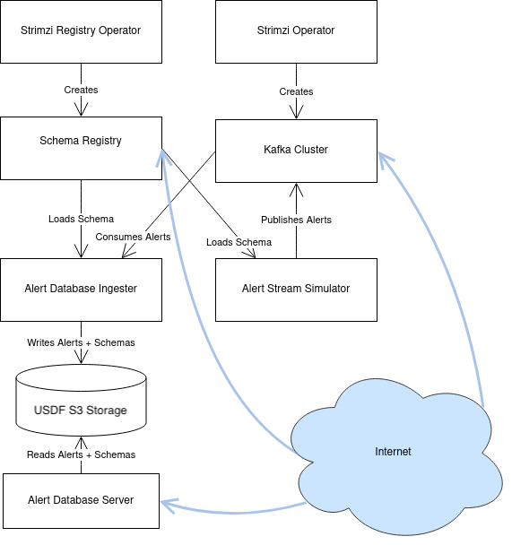

####################################################
Implementation of the LSST Alert Distribution System
####################################################

.. abstract::

   We describe the implementation of the LSST Alert Distribution System as deployed at the US Data Facility (USDF) at SLAC.

Overview
========

The Alert Distribution System delivers transient alert packets produced by Rubin Observatory's Prompt Processing pipelines to community brokers and archival storage.
This document describes the architecture and implementation of the system as deployed at the US Data Facility (USDF) at SLAC National Accelerator Laboratory.

This document aims to be a point-in-time record of what exists, and is subject to change as the system evolves.
An overview is provided of the system's concepts and components, and then each is described in detail.

At the highest conceptual level, it is composed of an Apache Kafka :cite:`kafka` cluster managed by Strimzi :cite:`strimzi`, a Confluent Schema Registry :cite:`confluent-schema-registry`, topic and user management
for community alert brokers, an alert database for archival storage, and monitoring tooling.

The system runs on dedicated Kubernetes clusters: ``usdfprod-prompt-processing`` for production and ``usdfdev-prompt-processing`` for development.
It is deployed as part of the **Sasquatch** Phalanx application :cite:`SQR-056`, which is Rubin Observatory's telemetry platform.

The overall design was envisioned in DMTN-093 :cite:`DMTN-093`.
In practice there are differences between this implementation and that design document due to practical requirements discovered during construction and production.

A companion document, DMTN-214 :cite:`DMTN-214`, provides an operator's manual with practical instructions, troubleshooting tips, and playbooks for the system.

Terminology and Concepts
========================

In order to explain the components that make up the Alert Distribution System, it's helpful to first establish some basic concepts behind deployments to Kubernetes in general, and
to Rubin's Kubernetes clusters in particular.

Resources
---------

Kubernetes is built on *resources*.
These are abstract descriptions of persistent entities that should be configured and run in a particular Kubernetes cluster.
Resources are defined in YAML files which are submitted to the Kubernetes cluster.

For example, Kubernetes uses resources to define what `services <https://kubernetes.io/docs/concepts/services-networking/service/>`__ should be running,
how `traffic <https://kubernetes.io/docs/concepts/services-networking/network-policies/>`__ should be routed, and
how `persistent storage <https://kubernetes.io/docs/reference/kubernetes-api/config-and-storage-resources/persistent-volume-v1/>`__ should be provisioned.

Kubernetes users are able to provide custom resource types; these are used in the Alert Distribution System to describe the desired Kafka configuration.

In addition, resources are configured to reside within a particular namespace.
These namespaces act as boundaries for authorization, as well as providing naming uniqueness for resources.
All alert stream resources reside in the ``sasquatch`` namespace, which is explained in :ref:`single-namespace`.

Operators
---------

Kubernetes *operators* are programs that run within the Kubernetes cluster, and take actions when resources are created, modified, or deleted.
There are many default operators, and others that are installed to the cluster explicitly.
The Alert Distribution System uses two such custom operators: Strimzi :cite:`strimzi` and Strimzi Registry Operator :cite:`strimzi-registry-operator`.
Both of these operators are managed by ``sasquatch``.

Strimzi provides Custom Resource Definitions (CRDs) for ``Kafka``, ``KafkaNodePool``, ``KafkaTopic``, and ``KafkaUser`` resources, allowing the entire Kafka deployment to be described declaratively.

Helm Charts
-----------

Helm :cite:`helm` is a project which provides tools for templating the YAML resource definitions used in Kubernetes.
The templates are called *Charts*, and provide a flexible way to represent common or repeated configuration.

For the Alert Distribution System, Helm charts are defined within the `Phalanx repository`_ under `applications/sasquatch/charts/`_.
Each major subsystem has its own chart directory.

Charts are reified into infrastructure using a set of *values* which populate the templates.
The values to be used are defined per-environment in files such as ``values-usdfprod-prompt-processing.yaml`` and ``values-usdfdev-prompt-processing.yaml``.

Phalanx
-------

Phalanx :cite:`SQR-056` is Rubin Observatory's deployment system for Kubernetes-based services.
It provides conventions for organizing Helm charts, managing secrets, and coordinating deployments through Argo CD.
The Alert Distribution System is deployed as a component of the ``sasquatch`` application within Phalanx.

Full documentation is available at `phalanx.lsst.io <https://phalanx.lsst.io/>`__.

Argo CD
-------

While Helm can be run as a tool on the command line, we use Argo CD :cite:`argo-cd` to run and monitor the application.
Argo CD is a platform for coordinating changes to a Kubernetes cluster, and it is able to run Helm directly.

The Alert Distribution System is managed through Argo CD instances at USDF:

- Production: https://usdfprod-prompt-processing.slac.stanford.edu/argo-cd/applications/argocd/sasquatch
- Development: https://usdfdev-prompt-processing.slac.stanford.edu/argo-cd/applications/argocd/sasquatch

Principal Components
====================

The Alert Distribution System has six principal components:

1. The **Strimzi Kafka** cluster (``strimzi-kafka`` chart) manages a KRaft-mode Kafka cluster with controller and broker node pools, providing the core message transport.
2. The **Schema Registry** (``schema-registry`` chart) is a Confluent Schema Registry instance that stores and serves Avro schemas used to encode alert packets.
3. The **Alert Stream Schema Sync** (``alert-stream-schema-sync`` chart) is a Kubernetes Job that loads alert packet schemas from the `lsst/alert_packet`_ repository into the Schema Registry.
4. The **Alert Brokers** (``alert-brokers`` chart) defines Kafka topics and user identities for community brokers that consume the alert stream.
5. The **Alert Database** (``alert-database`` chart) is a subsystem which archives alerts and schemas from Kafka into S3-compatible object storage and serves them via HTTP.
6. **Kafbat** (``kafbat`` chart) is a web-based monitoring UI for inspecting Kafka topics, consumer groups, schemas, and broker configuration.

   A diagram of the principal components and their relationships.

Each of the internal components will now be described in more detail.
In addition to these internal components, there are the clients which access the Alert Distribution System. These are described in :ref:`clients`.

Strimzi Kafka
-------------

Strimzi :cite:`strimzi` is a third-party software system for managing a Kafka cluster on Kubernetes.
It is used in the Alert Distribution System as an abstraction layer around the details of configuring Kafka on individual Kubernetes Pods and Nodes.

Strimzi works through Custom Resource Definitions, or "CRDs", which are installed once for the entire Kubernetes cluster across all namespaces.
This installation is performed automatically by Argo CD when installing the Strimzi Helm chart, as configured `in Phalanx <https://github.com/lsst-sqre/phalanx/tree/main/applications/strimzi>`__ as the 'strimzi' service.

The Strimzi Operator is a long-running application on Kubernetes which does all the work of actually starting and stopping Kubernetes Pods which run Kafka.
It also sets up Kubernetes Secrets which are used for authentication to connect to the Kafka broker, and can install ingresses for providing external access to the Kafka broker.

The Alert Stream uses the Strimzi :cite:`strimzi` operator and is deployed using KRaft consensus (no ZooKeeper dependency).
All configuration is defined in the `strimzi-kafka charts`_ and subsequent template yamls.

The yaml files within the chart define the following resources with general templates:

1. A ``Kafka`` resource which defines the cluster's listeners, authorization, and core configuration.
2. A ``Certificate`` resource used to provision a TLS certificate for the Kafka cluster's external address, defined in `certificates.yaml`_.
3. ``KafkaNodePool`` resources for controller and broker node pools.
4. ``KafkaUser`` resources for superuser and service accounts, defined in `superusers.yaml`_ and `users.yaml`_.
5. Optional ``KafkaRebalance`` resources for broker migration.

Additional yamls are present to configure other monitoring tools.

Each of these templates is then further refined within `values-usdfdev-prompt-processing.yaml`_ and
`values-usdfprod-prompt-processing.yaml`_.

``Kafka`` resource
~~~~~~~~~~~~~~~~~~

The ``Kafka`` resource is the primary configuration object of the Kafka cluster, defined in `kafka.yaml`_.
There's a lot going on in its configuration; this section attempts to explain some of the most important sections without going through every line.

KRaft Mode
~~~~~~~~~~

The Kafka cluster runs in KRaft mode, which replaces ZooKeeper with Kafka's built-in Raft-based metadata quorum.
This is configured through annotations on the ``Kafka`` resource:

.. code-block:: yaml

    annotations:
      strimzi.io/kraft: enabled
      strimzi.io/node-pools: enabled

KRaft mode uses separate *controller* nodes for metadata consensus and *broker* nodes for data handling.
These are defined as separate ``KafkaNodePool`` resources.

Node Pools
~~~~~~~~~~

The cluster uses two node pools:

**Controller Pool**: Handles metadata consensus.

.. code-block:: yaml

    apiVersion: kafka.strimzi.io/v1beta2
    kind: KafkaNodePool
    metadata:
      name: controller
      labels:
        strimzi.io/cluster: sasquatch
    spec:
      replicas: 5
      roles:
        - controller
      storage:
        type: jbod
        volumes:
        - id: 0
          type: persistent-claim
          size: 100Gi
          class: wekafs--sdf-k8s01
          deleteClaim: false

**Broker Pool**: Handles data storage and serving.

.. code-block:: yaml

    apiVersion: kafka.strimzi.io/v1beta2
    kind: KafkaNodePool
    metadata:
      name: kafka
      labels:
        strimzi.io/cluster: sasquatch
    spec:
      replicas: 5
      roles:
        - broker
      storage:
        type: jbod
        volumes:
        - id: 0
          type: persistent-claim
          size: 35Ti
          class: wekafs--sdf-k8s01
          deleteClaim: false

In the production environment, there are 5 controller nodes (IDs 0-4) and 5 broker nodes (IDs 5-9).
The development environment uses 3 controllers (IDs 0-2) and 5 brokers (IDs 3-7).

Both pools use the ``wekafs--sdf-k8s01`` storage class and have pod anti-affinity rules to ensure nodes are distributed across different Kubernetes hosts.

.. _listeners:

Listeners
~~~~~~~~~

The ``spec.kafka.listeners`` field of the resource defines the Kafka *listeners*, which are the network addresses which it opens to receive requests; this section is essential for configuring the Kafka cluster for both internal and external access.

Kafka's listeners are complicated, and configuring them through Kubernetes is even more so.
The Strimzi blog post series on "Accessing Kafka" :cite:`accessing-kafka`  provides very useful background for understanding this section.

We use three listeners: two internal listeners with ``tls`` authentication (meaning that clients need to use mTLS authentication to connect) and one external listener.

1. **plain** (port 9092): An internal listener without TLS encryption, using SCRAM-SHA-512 authentication. Used by clients inside the Kubernetes cluster.
2. **tls** (port 9093): An internal listener with TLS encryption and mutual TLS (mTLS) authentication. Used by the Schema Registry, Kafka Connect, and the Alert Database ingester.
3. **external** (port 9094): An external listener of type ``loadbalancer`` with SCRAM-SHA-512 authentication, accessible over the internet by community brokers.

The external listener uses MetalLB :cite:`metallb` to provision load balancers with static IP addresses.
Each broker and the bootstrap address are pinned to specific IPs using MetalLB annotations:

.. code-block:: yaml

    externalListener:
      tls:
        enabled: false
      bootstrap:
        host: rubin-alert-stream-bootstrap.slac.stanford.edu
        annotations:
          metallb.io/address-pool: sdf-dmz
          metallb.io/loadBalancerIPs: 134.79.23.209
        allocateLoadBalancerNodePorts: false
      brokers:
        - broker: 5
          host: rubin-alert-stream-broker-5.slac.stanford.edu
          annotations:
            metallb.io/address-pool: sdf-dmz
            metallb.io/loadBalancerIPs: 134.79.23.212
        # ... additional brokers

Static IPs are essential because Kafka clients must be able to connect to individual brokers by hostname.

Broker Configuration
~~~~~~~~~~~~~~~~~~~~

Apache Kafka configuration is handled through the ``config`` field of the ``Kafka`` resource:

.. code-block:: yaml

    config:
      offsets.topic.replication.factor: 3
      transaction.state.log.replication.factor: 3
      transaction.state.log.min.isr: 2
      default.replication.factor: 3
      min.insync.replicas: 2
      replica.lag.time.max.ms: 120000
      log.retention.minutes: 10080
      offsets.retention.minutes: 10080
      message.max.bytes: 10485760
      replica.fetch.max.bytes: 10485760

Key configuration choices:

- **Replication factor of 3** with **min in-sync replicas of 2**: Provides durability while allowing one broker to be unavailable.
- **Log retention of 7 days** (10080 minutes): Messages are kept for one week. This aligns with the alert packet retention time.
- **Message max size of 10MB**: Accommodates large alert packets.
- **Replica lag time of 120 seconds**: Prevents replicas from being removed from the ISR too aggressively; this must be at least as large as the Kafka Connect ``request.timeout.ms``.

Storage
~~~~~~~

The Kafka cluster's storage (that is, the backing disks used to store alert packet data) is configured directly in the ``Kafka`` resource:

.. code-block:: yaml

    storage:
      type: jbod
      volumes:
        # Note that storage is configured per replica. If there are 3 replicas,
        # and 2 volumes in this array, each replica will get 2
        # PersistentVolumeClaims for the configured size, for a total of 6
        # volumes.
      - id: 0
        type: persistent-claim
        size: {{ .Values.kafka.storage.size }}
        class: {{ .Values.kafka.storage.storageClassName }}
        deleteClaim: false

The "``jbod``" storage type requests "just a bunch of disks" - a simple storage backend.
The requests for storage are handled through Kubernetes PersistentVolumeClaims, which request persistent disks from the Kubernetes controller.

Note that these disks can be enlarged, but never shrunk.
This is a constraint of Strimzi in order to manage Kafka disk usage safely.

.. _kafka-certificates:

TLS Certificate
~~~~~~~~~~~~~~~

The TLS certificate for the broker's external listener (see :ref:`listeners`) is configured through a ``Certificate`` custom resource.
This custom resource is used by the cert-manager :cite:`cert-manager` system which is already installed on the Kubernetes cluster.

This system works by provisioning LetsEncrypt TLS certificates automatically and storing them in TLS secrets.
The Strimzi blog post "Deploying Kafka with Let's Encrypt certificates" :cite:`kafka-letsencrypt` provides a detailed discussion of how this works, although it assumes the use of "ExternalDNS" to manage DNS records, which is different.
The Rubin Science Platform's DNS is managed manually by the SQuaRE team in Route53, so all DNS records were created manually.

The most important part of the ``Certificate`` resource is the ``dnsNames`` field which requests TLS certificates for specific hostnames.
In our Kafka installation, we need multiple such hostnames: one for each individual broker (``rubin-alert-stream-broker-3-dev.slac.stanford.edu``, ``rubin-alert-stream-broker-4-dev.slac.stanford.edu``, etc), and one for the cluster-wide bootstrap address (``alert-stream-int.lsst.cloud``).
As explained in :ref:`listeners`, these can only be fully configured once an IP address for an external load balancer has been provisioned, so this resource may fail when first created.

Authentication
**************

Users authenticate using SCRAM-SHA-512 authentication, which is a username and password-based protocol.
The alert-stream-broker's `users.yaml`_ template configures each username, but lets passwords get generated separately and receives them through Kubernetes Secrets.
These passwords are then passed in to Kafka to configure the broker to expect them.

Storage
~~~~~~~
The Kafka cluster's storage (that is, the backing disks used to store alert packet data) is configured directly in the ``Kafka`` resource.

Each broker has 35 TiB of persistent storage using the ``wekafs--sdf-k8s01`` storage class (WekaFS distributed filesystem).
Controllers have 100 GiB each for metadata storage.

Storage uses the "JBOD" (just a bunch of disks) type with a single volume.
Note that Strimzi only allows storage to be enlarged, never shrunk. This is a constraint of Strimzi in order to manage Kafka disk usage safely.

Superusers
~~~~~~~~~~

Superuser accounts are defined with TLS-based authentication and full access to all topics and consumer groups.
The default superuser is ``kafka-admin``.
Superuser credentials are managed through the USDF Vault.

Cruise Control
~~~~~~~~~~~~~~

Strimzi Cruise Control is enabled for the cluster, providing automated partition rebalancing capabilities.
This is particularly useful when adding or removing brokers, as it can redistribute partition replicas across the cluster.

Kafka Exporter
~~~~~~~~~~~~~~

The Kafka Exporter is enabled to expose Prometheus metrics about topic offsets, consumer group lag, and broker health.
These metrics feed into Grafana dashboards for monitoring the alert stream.

Schema Registry
---------------

The Schema Registry runs an instance of Confluent Schema Registry :cite:`confluent-schema-registry` which stores and serves Avro schema documents.
These schemas are used by clients consuming alert data to deserialize binary-encoded alert packets.
The schemas provide instructions to Avro libraries on how to parse binary serialized alert data into in-memory structures, such as dictionaries in Python.

Confluent Schema Registry uses a Kafka topic as its backing data store.
The Registry itself is a lightweight HTTP API fronting this data in Kafka.

The Schema Registry is deployed directly as a Kubernetes Deployment via the `schema-registry chart`_.

This chart defines five resources:

1. A ``StrimziSchemaRegistry`` instance which is used by the Strimzi Registry Controller, creating a Deployment of the Schema Registry, in `strimzi-schema-registry.yaml`_.
2. A ``KafkaTopic`` used to store schema data inside the Kafka cluster, in `kafka-topic.yaml`_.
3. A ``KafkaUser`` identity used by the Schema Registry instance to connect to the Kafka cluster, in `kafka-user.yaml`_.
4. An Nginx ``Ingress`` which provides read-only access to the Schema Registry from over the public internet in `ingress.yaml`_.

The registry conneccts to the Kafka cluster using mTLS authentication on the internal TLS listener (port 9093) and stores schema data in a dedicated Kafka topic named ``registry-schemas``.

Schema Registry Configuration
~~~~~~~~~~~~~~~~~~~~~~~~~~~~~

The Schema Registry is configured with the following key settings:

- **Compatibility level**: ``none`` — No compatibility checking is enforced between schema versions. This allows schemas to evolve freely, which is necessary for the alert packet schema's development.
- **Replicas**: 3 instances for high availability.
- **Schema topic**: ``registry-schemas``, created as a ``KafkaTopic`` resource managed by the Strimzi Topic Operator.

Schema Registry Topic and User
~~~~~~~~~~~~~~~~~~~~~~~~~~~~~~

The Schema Registry stores all of its underlying schema data in a Kafka topic, which is configured in `kafka-topic.yaml`_.
This is set to use 3 replicas for durability, but is otherwise left to almost entirely use defaults.
This topic is automatically created by the Strimzi Topic Operator.

The Schema Registry needs a Kafka User identity as well to communicate with the Kafka cluster.
This user is configured in `kafka-user.yaml`_, which primarily is devoted to granting the correct permissions for the user to access the Schema Registry topic.

Schema Registry Ingress
~~~~~~~~~~~~~~~~~~~~~~~

The Schema Registry needs to be internet-accessible because its schemas are used by Rubin's Community Brokers when they are processing the alert stream.
Schemas are necessary for parsing each of the alert packets in the stream, and the Schema Registry is the authoritative source for schemas.

An Ingress is a Kubernetes resource which provides this external access to an internal system.
The Rubin Science Platform uses Nginx as the Ingress implementation :cite:`nginx`.

The Schema Registry is accessible from the internet through a dedicated ingress:

- Production: https://rubin-alert-schemas.slac.stanford.edu/schema-registry/
- Development: https://rubin-alert-schemas-dev.slac.stanford.edu/schema-registry/

Authorization
*************

The Schema Registry exposes an HTTP interface for access of this kind; however, it has no native support for access restrictions, so anyone who can reach it can create, modify, or even delete any schema data.
These features cannot be exposed to the general internet safely.

Therefore, the Ingress needs to *also* screen traffic to only permit read-only access.
This is accomplished through an inline Nginx "configuration snippet," which is a fragment of Nginx's own configuration language which gets injected into the Ingress's configuration.
This snippet denies all non-GET requests, and is configured through an annotation on the Ingress resource:

.. code-block:: yaml

    nginx.ingress.kubernetes.io/configuration-snippet: |
      # Forbid everything except GET since this should be a read-only ingress
      # to the schema registry.
      limit_except GET {
        deny all;
      }

This ensures that schemas can be read by anyone, but only internal systems can publish new schemas.

TLS and Hostnames
*****************

The typical way that ingresses work is through *merging*.
In this framework, all services share a hostname, and traffic is routed based on the path in the URL of an HTTP request.

This isn't possible for the Schema Registry since it lacks a universal URL path prefix that can distinguish the requests.
We can't have the ingress rewrite requests because the Schema Registry API clients generally don't have the ability to insert a leading path component either.
This means that the Schema Registry must run under its own dedicated hostname.

Since it runs on a separate hostname, it additionally needs to handle TLS separately.
This is done by configuring the Ingress with an annotation that requests a Lets Encrypt TLS certificate from cert-manager.
This is the same system that is used to provision TLS certificates for the Kafka broker (see :ref:`kafka-certificates`).

This explains the 'cert-manager.io/cluster-issuer' annotation in the ingress, which is set to the name of a Cluster Issuer already available on the Rubin Science Platform Kubernetes cluster:

.. code-block:: yaml

  annotations:
    kubernetes.io/ingress.class: "nginx"
    cert-manager.io/cluster-issuer: cert-issuer-letsencrypt-dns

It also explains the ``spec.tls.secretName`` value in `ingress.yaml`_:

.. code-block:: yaml

  spec:
    tls:
    - hosts: [{{ .Values.hostname | quote }}]
      secretName: "{{ .Values.name }}-tls"

For more on this, see the cert-manager documentation on `Securing Ingress Resources <https://cert-manager.io/docs/usage/ingress/>`__.

Schema Format
~~~~~~~~~~~~~

The Schema Registry responds to a request for a particular schema (for example, https://rubin-alert-schemas.slac.stanford.edu/schema-registry/schemas/ids/701) with a JSON payload:

.. code-block:: json

   {
      "schema": "<schema-document-as-a-string>"
   }

Avro schema documents are JSON objects, but the Schema Registry flattens this into a single escaped string.
Clients must doubly-deserialize: first parse the outer response, then parse the value under the ``"schema"`` key.

Alert Stream Schema Sync
------------------------
Once the Schema Registry is running, we need to insert the right versions of the Rubin alert schema into the registry.

The Alert Stream Schema Sync is a Kubernetes Job that loads all alert packet schemas from the `lsst/alert_packet`_ repository into the Schema Registry.
It is defined in the `alert-stream-schema-sync chart`_.

The Job is triggered on each Argo CD sync via the annotation:

.. code-block:: yaml

    annotations:
      argocd.argoproj.io/hook: Sync

Job Configuration
~~~~~~~~~~~~~~~~~

The Job runs the ``syncAllSchemasToRegistry`` program from the ``lsstdm/lsst_alert_packet`` Docker container:

.. code-block:: yaml

    containers:
    - name: sync-schema-job
      image: "lsstdm/lsst_alert_packet:w.2026.19"
      command:
        - "syncAllSchemasToRegistry"
        - "--schema-registry-url=http://sasquatch-schema-registry:8081"
        - "--subject=alert-packet"

The Job has a TTL of 600 seconds after completion (``ttlSecondsAfterFinished: 600``), after which it is automatically cleaned up.

Schema ID Assignment
~~~~~~~~~~~~~~~~~~~~

Schema IDs are derived from the alert packet schema version number.
The major version number is multiplied by 100 and the minor version is added.
For example:

- Schema version 7.1 → Schema ID 701
- Schema version 10.0 → Schema ID 1000
- Schema version 11.0 → Schema ID 1100

This assignment ensures that re-running the sync Job always produces the same schema-to-ID mapping.

Versioning
~~~~~~~~~~

The Docker container used for schema sync is tagged with a Git ref from the `lsst/alert_packet`_ repository (e.g., ``w.2026.19`` for a weekly build).
This container is automatically built by a GitHub Actions workflow (``build_sync_container.yml``) and pushed to Docker Hub as ``lsstdm/lsst_alert_packet``.

The image tag is configured in the per-environment values file under ``alert-stream-schema-sync.schemaSync.image.tag``.

Note that this version is probably **not** the version of the Alert Packet Schema that will be synchronized since the version of the alert_packet repository is independent from that of the schemas.

If syncing the registry does not trigger a refresh of the Docker image, the Docker ``digest`` can be passed to ``schemaSync.image.digest`` which can force a refresh of the Docker image.

When the Job runs
*****************

The Job runs whenever the full alert-stream-broker Phalanx service is synchronized in Argo CD, not when individual components are synced.
This means that it is run on essentially any change to any of the components of the entire Alert Distribution System, not just when the alert packet schema changes.

This is perhaps unnecessarily often, but no user-facing changes will be apparent as the schema ids are manually assigned. The schema registry
will be remade the same way every sync.

.. _kafka-users:

Alert Brokers
-------------

The Alert Brokers chart (``alert-brokers``) manages the Kafka topics and user identities that allow community brokers to consume the alert stream.
It is defined in the `alert-brokers chart`_.

The chart creates two types of resources:

1. ``KafkaTopic`` resources defining the alert stream topics.
2. ``KafkaUser`` resources defining community broker identities and their access permissions.

Topics
~~~~~~

Alert topics are defined in the per-environment values file:

.. code-block:: yaml

    topics:
      - name: alert-stream-test
        partitions: 400
        replicas: 3
      - name: alerts-simulated
        partitions: 45
        replicas: 3
      - name: lsst-alerts-v11
        partitions: 45
        replicas: 3
        bytesRetained: "300000000000"
        millisecondsRetained: "2629740000"

The primary production topic is ``lsst-alerts-v11``, which holds alerts encoded with schema version 11.
The topic is partitioned into 45 partitions (matching the number of detector rafts) with 3 replicas for durability.
Retention is configured for approximately 300 GB or 30 days, whichever is reached first.

The ``KafkaTopic`` template iterates over this list:

.. code-block:: yaml

    {{- range $topic := .Values.topics }}
    ---
    apiVersion: kafka.strimzi.io/v1
    kind: KafkaTopic
    metadata:
      name: {{ $topic.name }}
      labels:
          strimzi.io/cluster: {{ $cluster }}
    spec:
      replicas: {{ $topic.replicas }}
      partitions: {{ $topic.partitions }}
      config:
        retention.ms: {{ $topic.retention }}
    {{- end }}

Community Broker Users
~~~~~~~~~~~~~~~~~~~~~~

Community broker users are created with SCRAM-SHA-512 authentication and limited read-only permissions.
A YAML anchor (``communityReadonlyTopics``) defines the set of topics accessible to all community brokers:

.. code-block:: yaml

    communityReadonlyTopics: &communityReadonlyTopics
      - "alerts-simulated"
      - "lsst-alerts-v11"

    users:
      - username: "alerce-usdf"
        topics: *communityReadonlyTopics
        groups:
          - "alerce-usdf"
      - username: "fink-usdf"
        topics: *communityReadonlyTopics
        groups:
          - "fink-usdf"
      # ... additional brokers

Each user receives:

- **Read-only access** to the topics listed in ``communityReadonlyTopics`` (Read, Describe, DescribeConfigs operations).
- **Full access** to consumer groups prefixed with their username (all operations on groups matching the prefix pattern).

This means a user like ``fink-usdf`` can create consumer groups named ``fink-usdf``, ``fink-usdf-testing``, etc., but cannot access groups belonging to other brokers.

It is simple to add and remove topics for brokers by adding the new topic to the communityReadonlyTopics configuration.

Service Accounts
~~~~~~~~~~~~~~~~

In addition to community broker users, service accounts are defined for internal systems that *publish* alerts:

.. code-block:: yaml

    serviceAccounts:
      - username: "prompt-alert"
        topics: *communityReadonlyTopics
        additionalTopics:
          - "alert-stream-test"

Service accounts are granted Write and Describe permissions on their assigned topics.
The ``prompt-alert`` account is used by Prompt Processing to publish alert packets into the Kafka topics.

Password Management
~~~~~~~~~~~~~~~~~~~

User passwords are stored in the USDF Vault and synchronized into the ``sasquatch`` Kubernetes Secret.
The ``KafkaUser`` resources reference these passwords:

.. code-block:: yaml

    spec:
      authentication:
        type: scram-sha-512
        password:
          valueFrom:
            secretKeyRef:
              name: "sasquatch"
              key: {{ $user.username }}-password

Passwords can be managed through 1Password (via the RSP-Vault vault in the LSST IT account) and synchronized to the USDF Vault, or set directly in the USDF Vault.
See DMTN-214 :cite:`DMTN-214` for operational procedures.

Alert Database
--------------

The Alert Database is responsible for storing an archival copy of all alert data published to the alert stream.
It stores alert packets and schemas in S3-compatible object storage and provides HTTP-based access to the archive.

The Alert Database's design is described in DMTN-183 :cite:`DMTN-183`.

An *ingester* consumes data from the published alert stream and copies it (along with any schemas referenced) into the backing object store.
The ingester is implemented in the `lsst-dm/alert_database_ingester`_ repository.

The implementation is deployed via the `alert-database chart`_, and writes the alerts to an S3 bucket at the USDF.

The chart has the following components:

1. A Deployment for the **ingester**, which consumes alerts from Kafka and writes them to S3.
2. A ``KafkaUser`` for the ingester to authenticate to Kafka.
3. A Service and Ingress for external access to the server.

Ingester
~~~~~~~~

The ingester consumes alert packets from Kafka and writes them (along with referenced schemas) to S3-compatible object storage at ``sdfdatas3.slac.stanford.edu``.

It is implemented in the `lsst-dm/alert_database_ingester`_ repository and deployed as a Kubernetes Deployment:

.. code-block:: yaml

    containers:
      - name: "alert-database-ingester"
        image: "lsstdm/alert_database_ingester:v4.1.0"
        command:
          - "alertdb-ingester"
          - "--kafka-host=sasquatch-kafka-bootstrap:9093"
          - "--kafka-topics=lsst-alerts-v11"
          - "--tls-client-key-location=/etc/kafka-client-secret/user.key"
          - "--tls-client-crt-location=/etc/kafka-client-secret/user.crt"
          - "--tls-server-ca-crt-location=/etc/kafka-server-ca-cert/ca.crt"
          - "--kafka-auth-mechanism=mtls"
          - "--schema-registry-address=http://sasquatch-schema-registry:8081"
          - "--endpoint-url=https://sdfdatas3.slac.stanford.edu/"
          - "--bucket-alerts=rubin-alert-archive"
          - "--bucket-schemas=rubin-alert-archive"
          - "--verbose"

Key aspects of the ingester:

- **Kafka connection**: Uses mTLS authentication on the internal TLS listener (port 9093). Client certificates are mounted from Strimzi-generated secrets.
- **S3 storage**: Writes to the ``rubin-alert-archive`` bucket at the USDF S3 endpoint. AWS credentials are provided from the ``sasquatch`` Kubernetes secret.
- **Schema Registry**: Connects to the cluster-internal Schema Registry to retrieve schema metadata.
- **Single bucket**: The USDF uses a single bucket for the schemas and the alerts, seperated out by specific keys.

Alert Database
--------------

The Alert Database provides access to all published alerts and their schemas over HTTP.
The primary user-facing interface is `Herald <https://herald.lsst.io>`__ :cite:`SQR-114`, which provides search and browsing capabilities.

KEDA Autoscaling
~~~~~~~~~~~~~~~~

The ingester supports KEDA-based autoscaling, which scales the number of ingester replicas based on Kafka consumer group lag:

.. code-block:: yaml

    autoscaling:
      enabled: false
      minReplicaCount: 1
      maxReplicaCount: 10
      lagThreshold: "100"
      activationLagThreshold: "10"
      pollingInterval: 30
      cooldownPeriod: 300
      consumerGroup: "alertdb-ingester"

When enabled, KEDA monitors the ``alertdb-ingester`` consumer group's lag and scales replicas up when lag exceeds the threshold.
This allows the ingester to handle bursty alert production without over-provisioning during quiet periods.

User Interface
~~~~~~~~~~~~~~

The primary user-facing access to the alert archive is through `Herald <https://herald.lsst.io>`__ (described in SQR-114 :cite:`SQR-114`), which provides a richer UI built on top of the alert database API.

Kafbat
------

Kafbat :cite:`kafbat` is a web-based UI for monitoring and inspecting the Kafka cluster.
It is deployed via the `kafbat chart`_.

Kafbat provides dashboards for:

- Viewing topic contents and configuration
- Monitoring consumer group lag and membership
- Inspecting the Schema Registry contents
- Viewing broker configuration and metrics
- Examining Access Control Lists (ACLs)

Configuration
~~~~~~~~~~~~~

Kafbat is configured in read-only mode (``resourceLocking: true``) to prevent accidental modifications through the UI.
It connects to the Kafka cluster via TLS on port 9093 and filters displayed topics by prefix:

.. code-block:: yaml

    kafka:
      bootstrap: "sasquatch-kafka-bootstrap.sasquatch:9093"
      topicPrefixes:
        - "alert"
        - "lsst"
        - "registry"

It is accessible at:

- Production: https://usdfprod-prompt-processing.slac.stanford.edu/kafbat/
- Development: https://usdfdev-prompt-processing.slac.stanford.edu/kafbat/

Access requires SLAC credentials.

.. _clients:

Clients
=======

Clients access the Alert Distribution System from across the public internet.
There are two subsystems that they access: Kafka and the Schema Registry.

Both of these have different access mechanisms which are discussed in this section.

Kafka Clients
--------------

The Kafka system provides the stream of alert packet data in Kafka topics.

Each alert is delivered as a separate Kafka message, encoded in Confluent Wire Format :cite:`confluent-wire-format`.
That is, the Kafka message starts with a zero byte, then a 4-byte big-endian integer representing the *schema ID*, and then the alert data in binary-encoded Avro format.

The Schema ID can be provided to the Schema Registry to retrieve an Avro schema document which can be used to deserialize the binary-encoded Avro data into an alert packet.

Messages are retained in the production alert topic for 7 days.

Clients connect to the alert stream by accessing the bootstrap URL of the Kafka cluster:

- Production: ``rubin-alert-stream-bootstrap.slac.stanford.edu:9094``
- Development: ``rubin-alert-stream-broker-bootstrap-dev.slac.stanford.edu:9094``

They must provide their username and password under SCRAM-SHA-512 authentication, and must use a consumer group ID which is prefixed with their username (see also: :ref:`kafka-users`).

Detailed walkthroughs of connecting to the Kafka endpoint are provided in the `Alert Stream Integration Endpoint Examples`_.

.. _Alert Stream Integration Endpoint Examples: https://github.com/lsst-dm/sample_alert_info/tree/main/examples/alert_stream_integration_endpoint

Schema Registry Clients
-----------------------

The Schema Registry provides read-only access to the Avro schemas used to encode alert packets.
It uses the Confluent Schema Registry API :cite:`schema-registry-api`; only GET endpoints are accessible over the internet.

The registry runs at:

- Production: https://rubin-alert-schemas.slac.stanford.edu/schema-registry/
- Development: https://rubin-alert-schemas-dev.slac.stanford.edu/schema-registry/

Users are expected to use a client library (typically as part of their Kafka client library) to connect.
Detailed examples are available in the `Alert Stream Integration Endpoint Examples`_.

A note on the schema registry response format
~~~~~~~~~~~~~~~~~~~~~~~~~~~~~~~~~~~~~~~~~~~~~

The Schema Registry responds to a request for a particular schema (for example, https://usdf-alert-schemas-dev.slac.stanford.edu/schemas/ids/701) with a JSON payload.
The JSON payload's shape is:

.. code-block:: json

   {
      "schema": "<schema-document-as-a-string>"
   }

Avro schema documents are JSON objects already, but the Schema Registry flattens this JSON object into a single string, adding escape backslashes in front of each double-quote character, and stripping it of whitespace.
So, for example, this schema:

.. code-block:: json

  {
    "type": "record",
     "namespace": "com.example",
     "name": "FullName",
     "fields": [
       { "name": "first", "type": "string" },
       { "name": "last", "type": "string" }
     ]
  }

would be encoded like this:

.. code-block:: json

   {
      "schema": "{\"type\":\"record\",\"namespace\":\"com.example\",\"name\":\"FullName\",\"fields\":[{\"name\":\"first\",\"type\":\"string\"},{\"name\":\"last\",\"type\":\"string\"}]}"
   }

This can be quite confusing, but to use the schema it must be doubly-deserialized: first the outer response needs to be parsed, then the value under the ``"schema"`` key must be parsed.

Design Decisions
================

This section lists particular overall design decisions that went into the Alert Distribution System.

.. _single-namespace:

Single Namespace
----------------

All Strimzi and alert stream resources reside in the ``sasquatch`` namespace.
This is done because it's the simplest way to allow internal authentication to the Kafka cluster using Kubernetes Secrets.

The Strimzi Operator creates Kubernetes Secrets for each ``KafkaUser`` associated with a Kafka cluster that it manages.
These Secrets hold all of the data required for a Kafka client to connect to the broker: TLS certificates, usernames, passwords — anything needed for a particular authentication mechanism.

The Secrets are created automatically, and will be updated or rotated automatically if the Kafka Cluster is changed.
However, they cannot be accessed across namespace boundaries; they must be resident in a single namespace and can only be used from there.
Strimzi creates them in the same namespace as the ``Kafka`` resources.

Since we want to also use the Secrets for access from applications, this means that the applications need to all reside in the same namespace as the ``Kafka`` resource - effectively requiring that everything be in one namespace if it needs to access Kafka internally.

This isn't particularly consequential in practice, although it has a few downsides:

1. All applications need to be bundled together into one Phalanx service, resulting in a cluttered view with many, many resources in Argo CD's UI.
   This view can be hard to browse.
2. Applications may have access to more than is necessary, since Kubernetes Roles often grant access to resources within a namespace boundary.
   Bundling things into one namespace removes that protection.
   In practice, there aren't any Kubernetes permissions granted to any of the applications, so this may be a moot point at this time, but things may change as the system evolves.

As an alternative, the Kubernetes Secrets could be reflected into multiple namespaces using a custom Operator.
However, this would come at the cost of extra cluster-wide complexity.
If multiple systems on the cluster would take advantage of such an operator, it might be worthwhile overall.

Using Strimzi
-------------

All Kafka broker configuration, topic configuration, and user configuration is handled through Strimzi resources.

This means that there is yet another layer of configuration indirection.
Instead, the system could have been built from "bare" Kubernetes Deployments, ConfigMaps, and so on.

But this would be very, very complex, and lifecycle management is particularly tricky.
For example, when user credentials are rotated, the Kafka broker needs to be informed, and in some cases it needs to be restarted; this restart process needs to be done gradually, rolled out one-by-one across the cluster to avoid having complete downtime.
Then, the credentials need to be bundled into Secrets to be passed to applications, and those applications likely would need to be restrated as well.
Strimzi handles all of this complexity without any extra effort from Rubin developers.

Internal networking complexity gets even harder, as Kafka requires several internal communication channels for management of the cluster.
Strimzi handles this as well - and it's a particularly difficult thing to debug.

.. _sasquatch-integration:

Sasquatch Integration
---------------------

The Alert Distribution System is deployed as part of the Sasquatch application rather than as a standalone Phalanx application.
This was done because:

- Sasquatch already manages the Strimzi operator and Kafka infrastructure for Rubin's telemetry needs.
- Sharing the Strimzi installation avoids conflicts from multiple operator instances.
- The alert stream's Kafka cluster benefits from Sasquatch's existing monitoring, secret management, and deployment infrastructure.
- It simplifies the deployment surface: one Argo CD application manages all Kafka-related infrastructure.

The alert stream components are enabled per-environment through boolean flags in the values files (e.g., ``alert-brokers.enabled: true``), allowing them to be deployed only on the prompt-processing clusters where they are needed.

.. Repositories:
.. _lsst/alert_packet: https://github.com/lsst/alert_packet
.. _lsst-dm/alert_database_ingester: https://github.com/lsst-dm/alert_database_ingester/

.. Phalanx config:
.. _Phalanx repository: https://github.com/lsst-sqre/phalanx
.. _applications/sasquatch/charts/: https://github.com/lsst-sqre/phalanx/tree/main/applications/sasquatch/charts

.. Charts:
.. _strimzi-kafka charts: https://github.com/lsst-sqre/phalanx/tree/main/applications/sasquatch/charts/strimzi-kafka/templates/kafka.yaml
.. _schema-registry chart: https://github.com/lsst-sqre/phalanx/tree/main/applications/sasquatch/charts/schema-registry
.. _alert-stream-schema-sync chart: https://github.com/lsst-sqre/phalanx/tree/main/applications/sasquatch/charts/alert-stream-schema-sync
.. _alert-brokers chart: https://github.com/lsst-sqre/phalanx/tree/main/applications/sasquatch/charts/alert-brokers
.. _alert-database chart: https://github.com/lsst-sqre/phalanx/tree/main/applications/sasquatch/charts/alert-database
.. _kafbat chart: https://github.com/lsst-sqre/phalanx/tree/main/applications/sasquatch/charts/kafbat

.. strimzi-kafka templates:
.. _kafka.yaml: https://github.com/lsst-sqre/phalanx/blob/main/applications/sasquatch/charts/strimzi-kafka/templates/kafka.yaml
.. _certificates.yaml: https://github.com/lsst-sqre/phalanx/blob/main/applications/sasquatch/charts/strimzi-kafka/templates/certificates.yaml
.. _superusers.yaml: https://github.com/lsst-sqre/phalanx/blob/main/applications/sasquatch/charts/strimzi-kafka/templates/superusers.yaml
.. _users.yaml: https://github.com/lsst-sqre/phalanx/blob/main/applications/sasquatch/charts/strimzi-kafka/templates/users.yaml

.. schema-registry templates:
.. _strimzi-schema-registry.yaml: https://github.com/lsst-sqre/phalanx/blob/main/applications/sasquatch/charts/schema-registry/templates/strimzi-schema-registry.yaml
.. _kafka-topic.yaml: https://github.com/lsst-sqre/phalanx/blob/main/applications/sasquatch/charts/schema-registry/templates/kafka-topic.yaml
.. _kafka-user.yaml: https://github.com/lsst-sqre/phalanx/blob/main/applications/sasquatch/charts/schema-registry/templates/kafka-user.yaml
.. _ingress.yaml: https://github.com/lsst-sqre/phalanx/blob/main/applications/sasquatch/charts/schema-registry/templates/ingress.yaml

.. Values files:
.. _values-usdfdev-prompt-processing.yaml: https://github.com/lsst-sqre/phalanx/blob/main/applications/sasquatch/values-usdfdev-prompt-processing.yaml
.. _values-usdfprod-prompt-processing.yaml: https://github.com/lsst-sqre/phalanx/blob/main/applications/sasquatch/values-usdfprod-prompt-processing.yaml
.. _values-idfint.yaml: https://github.com/lsst-sqre/phalanx/blob/main/applications/sasquatch/values-idfint.yaml

.. .. rubric:: References

.. bibliography::
